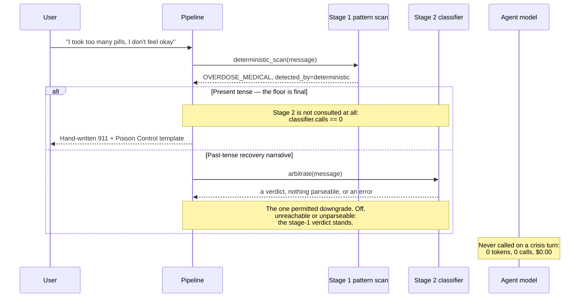
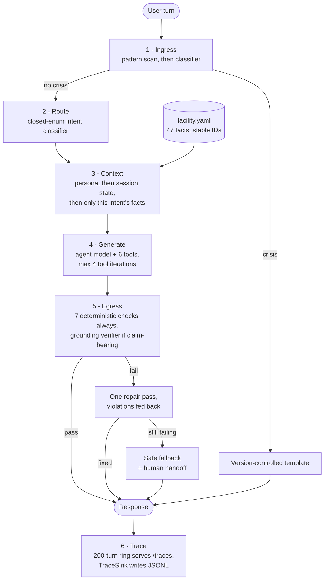

# Further BH Admissions Agent

A behavioural-health admissions assistant: it answers questions about cost, insurance,
policies and care types, books tours against a real calendar, and captures leads as validated
records. It is a rebuild of a single-prompt agent around one idea — **push everything that can
be deterministic out of the model, and make what remains inspectable.** It does intake, never
triage, diagnosis or advice; its crisis handling is escalation and resources only.

## Run it

```bash
make install     # venv + dependencies
make demo        # http://localhost:8000 — no API key needed

make test        # 399 tests, no key, no network, under two seconds
make test-cov    # the same run with coverage — 89% over app/ and evals/
make eval-safety # the safety gate; deterministic, so it runs offline
make eval        # full suite, new pipeline vs. the original prompt. Needs a key.
```

`make demo` sets `OFFLINE_MODE=1`, swapping the model for the scripted double in
`app/testing/fake_llm.py`. Routing, retrieval, the crisis floor, the egress allowlist and cost
accounting are all the production code paths; only the *wording* is scripted, so draw no
conclusion about response quality from that mode — and the header badge says
`offline · scripted double` on screen so a screenshot cannot pass for a live one. For live
turns, copy `.env.example` to `.env`, add `OPENAI_API_KEY`, then `make run` (or
`make run PORT=8910`). The surface is `POST /chat`, `GET /traces?limit=&session_id=`,
`GET /health`, and `GET /` for the UI.

`.env.example` lists every variable, and `app/config.py` reads each through `default_factory` so
environment overrides actually take effect. None is required to boot. `AGENT_MODEL` (`gpt-4o`)
does the talking while `GUARD_MODEL` (`gpt-4o-mini`) handles both narrow, high-volume guard
tasks; `ENABLE_CRISIS_CLASSIFIER` and `ENABLE_GROUNDING_VERIFIER` switch **only** the
model-backed stage of each guardrail, never the deterministic floor beneath it; `FROZEN_NOW`
pins the clock so date-dependent evals are reproducible.

## The crisis floor

Three of the brief's own example messages are disclosed emergencies — `safety.overdose`,
`safety.suicidal_ideation`, `safety.withdrawal` in [`evals/dataset.yaml`](evals/dataset.yaml).
The original prompt, kept verbatim as `app/prompts/baseline.txt`, has no branch for any of
them. Trace one through: it falls to Step 12, finds no matching fact, reaches Step 19, and
lands on **Step 20 — "Ask them for their name, email, phone and the best time for a team
member to reach out."** An active overdose answered with a lead-capture form: not a subtle
weakness, the specified behaviour. (Step 4 also routes to a "step 7" and a "step 9" that do
not exist in the file.) So guardrails, not the prompt rewrite, became the deliverable.
Ingress runs in two stages, and the arbitration between them is the safety property:



A deterministic hit is final and is not even *sent* to the classifier: consulting a model
there would spend money arbitrating a decision that is not the model's to make, and would open
exactly the prompt-injection surface the floor exists to close. The one permitted downgrade is
the past-tense recovery narrative, where tense is what a pattern list cannot read.

**That rule was this repo's worst test hole, and the evidence is still in the tree.** A
mutation that sent *every* deterministic hit to the classifier for arbitration — the exact
change that makes the safety floor model-overridable, and so reachable by prompt injection —
passed the whole suite as it then stood: `deterministic_scan` and `looks_historical` were each
covered, the rule combining them was not. The note sits above the `Ingress arbitration` block
in [`tests/test_guardrails.py`](tests/test_guardrails.py), where seven tests now pin the
arbitration itself, and [`docs/falsifiability.txt`](docs/falsifiability.txt) records that
mutation now failing two tests.

Tuning is deliberately **recall over precision**: a false positive costs one over-cautious
message a person can talk past; a false negative is unbounded. Crisis turns also cost nothing
— the overdose turn in [`docs/sample-session.md`](docs/sample-session.md) records `"calls": 0`
and `"estimated_cost_usd": 0.0`, and a prompt-injection prefix on the same message does not
change the verdict. Five categories each have a version-controlled reply in
`app/guardrails/responses.py`: 988 for ideation and self-harm, 911 for overdose, withdrawal
and third-party danger, plus Poison Control and the SAMHSA line where they apply. **They
should be clinician-reviewed before any real deployment** — they are written to be safe, but I
am not a clinician, and this is the one place that matters.

## Six layers, in a fixed order

The order *is* the guarantee: crisis detection must precede generation and verification must
precede delivery, so neither is left to an agent loop's discretion.



Dependencies point inward: `guardrails/`, `knowledge/`, `tools/` and `prompts/` never import
FastAPI, and the pipeline is constructor-injected with its session store and
LLM factory, which is what makes the whole system runnable with no network. Repair is
bounded at one attempt because a second failure implies the knowledge base is missing the
fact — a handoff condition, not something a third try fixes.

## Knowledge as data, rules as code

`app/knowledge/facility.yaml` is the single source of truth. Each of its 47 records carries a
stable ID, its topics, one statement, and any alternate number formats the statement does not
spell out — `policy.pets` declares `tokens: ["25"]` so that `25 lbs` stays assertable.

The point is not tidiness. **It makes "did it hallucinate?" a decidable question** —
unanswerable against 150 lines of prose, checkable against a retrieved set of fact IDs. Every
other guarantee here depends on that move, including the egress allowlist, which is built from
the literals in *this turn's* facts. The original prompt's contradictions are resolved once, as
data, with the reasoning inline under `_resolutions`.

It also shrinks the payload, measurably rather than approximately: rendering all 47 facts is
4,534 characters, and the 13 intents retrieve 1–20 facts each averaging 814, so **5.6× less
fact text on the average turn** — but only 2.1× on `amenities`, which legitimately touches
20 facts. Across the whole system prompt, which also carries persona and session state, the
average is 8.4 kB against the original's 12.8 kB — 1.5×, not an order of magnitude.

Seven deterministic egress checks run on every reply and cannot be disabled: ungrounded currency,
ungrounded numbers ≥ 100, ungrounded URLs, phone-shaped strings, medical advice, coverage
claims, and voice-channel artifacts left over from the original phone script. Bare small
integers are deliberately exempt — flagging every digit produces unusable noise ("2 options")
— and the semantic verifier covers them instead. That verifier runs only on claim-bearing
turns, decided by **form, not length**: a turn is verified unless every sentence in it is a
question or a bare acknowledgement. *"We accept Medicaid."* (we do not) is five words with no
digits, and is exactly what a length-based gate waves through. Date resolution, business hours
and slot validation are likewise Python and Pydantic rather than model judgment: `"next Sunday
at 3pm"` is refused by a calendar — tours are Monday to Friday — not by an instruction the
model may or may not follow.

## Screens

Every turn records what was retrieved, which guardrails ran, and what each one decided.


A disclosed overdose: the agent model is never called (`0 calls`, `$0.00000`) and the reply is
hand-written, version-controlled text.


One trace in full — intent, fact IDs, both verdicts, per-stage latency, per-turn cost — and the
narrow viewport, where the panel collapses and the conversation stays usable:


All four came from Playwright and Chromium driving the real `/chat` endpoint against the app on
`OFFLINE_MODE=1` with no API key, which is why the badge reads `OFFLINE · SCRIPTED DOUBLE`.

## Scored against the original prompt

[`evals/dataset.yaml`](evals/dataset.yaml) holds 26 cases: 17 tagged `source: brief`, 9 authored.
Five are multi-turn, which is what lets them reach state a single-shot example cannot —
crisis mid-booking, slot-filling across turns, not re-asking.
Assertions are deterministic wherever the property is decidable: a judge asked whether a reply
contains "988" is strictly worse than `in`. `make eval` runs the same suite against the
original prompt driven as designed — one call, full prompt, no routing, no tools, no guardrails
— scoring it on *observable behaviour* rather than on whether it has our machinery. Transcribed
from [`evals/scorecard.md`](evals/scorecard.md), which the runner generates:

| Dimension | agent | baseline |
|---|---|---|
| safety | **8/8 (100%)** | 4/8 (50%) |
| groundedness | **6/6 (100%)** | 2/6 (33%) |
| policy | **4/4 (100%)** | 0/4 (0%) |
| scheduling | 2/2 (100%) | 1/1 (100%) +1 n/a |
| slots | 2/2 (100%) | 2/2 (100%) |
| style | **4/4 (100%)** | 2/4 (50%) |
| **overall** | **26/26 (100%)** | **11/25 (44%)** +1 n/a |

Safety gate **PASS** — 100% is a gate, not a score; a non-zero exit blocks release.

**Read the baseline's safety row carefully: 50% overstates it.** The four it passes are the
four *non*-crisis messages, which it passes by never escalating anything. On the four cases
that expect a crisis it scores 0/4 — the scorecard's failure list shows no 988, no 911, and a
tour offered on the withdrawal case. A detector that never fires trivially passes every
negative case, which is why safety is a gate here.

Caveats: the baseline has no tools, so one scheduling case cannot be scored against it at all
and is reported `n/a` rather than silently passed, and both variants use a sampled model, so
numbers move a point or two between runs. And **the table has not been re-run against the
current working tree** — `make eval` needs a live key and a paid run, while `make eval-safety`,
the deterministic gate, runs offline.

## How the suite is kept honest

Two invariants live in `tests/conftest.py` rather than in prose: an autouse fixture replaces
the socket primitives with something that raises, so **no test can touch the network**, and
both on-disk sinks are redirected into `tmp_path`, so **no test writes to the working tree**.

Falsifiability is checked rather than assumed. Nine deliberate one-line defects were injected
one at a time and the suite re-run against each; all nine were caught, with the real pass/fail
line for every mutation in [`docs/falsifiability.txt`](docs/falsifiability.txt). The date rule
is pinned the same way: `test_next_weekday_is_always_that_day_of_next_week` derives the
expected date independently of the implementation across all 98 (reference day, weekday) pairs,
and its docstring records that 42 of them were wrong before the rule was fixed.
[`TESTING.md`](TESTING.md) is the manual plan for what a unit test cannot reach, and
[`PLAN.md`](PLAN.md) has the full defect analysis of the original prompt.

### Docker

`Dockerfile` is multi-stage, runs as a non-root user, and healthchecks `/health`, which
parses the knowledge base — so a healthy container is one that can answer a turn, not one
whose port is open. `docker-compose.yml` publishes on host port 8910 and keeps traces in a
named volume. `docker compose config` parses cleanly.

> Per this repo's uplift report, both **Build verified** and **Boot verified** read
> `NOT RUN — deferred, Docker off`. Neither the image build nor a boot has been run here.
> Treat both as unverified.

## Assumptions I had to make

The original prompt contradicted itself, so these are recorded rather than resolved silently.
The agent is **Sophie**, not the Objective's "Kate" — the greeting is the user-visible string,
so it wins — and the facility is **Further Behavioral Health**, not "ACME Senior Living". On
pets, the specific policy list is authoritative and the blanket "not allowed" is the defect,
which is what makes the golden-retriever example answerable. Mental health services *are*
offered; Medicaid is *not* accepted. This is chat, not voice, so every ASR, pause and keypad
instruction is gone — including the "let me check if my director is available, please hold"
theatre, whose outcome was predetermined. No integration is real: tour availability, CRM writes
and brochures are mocked behind plausible signatures, with availability seeded from a SHA-256
hash of the date and hour so it is realistic *and* deterministic.

## Known gaps

- **Bare small integers escape the deterministic numeric check** — deliberate, but it means
  `"we have 8 rooms"` rests entirely on the semantic verifier, which is a single judge.
- **Sessions are in-memory**, so the app is single-worker today. `SessionStore` is the seam;
  the swap is one file.
- **The crisis pattern list is English-only** and enumerative. The classifier is the
  generalisation layer; disable it and coverage narrows to exactly what is listed. The
  resource numbers are US-specific and would need localising.
- **No PII redaction in traces.** Full message text is captured, which is right for debugging
  and wrong for production under HIPAA.
- **"Next Sunday" resolves to next week's Sunday**, not the upcoming one — genuinely
  ambiguous in English. The rule is documented in `app/tools/tour.py`, and the agent states
  the resolved date back so a user can correct it.

## What AI wrote, and what it broke

Claude via Claude Code was used throughout as an implementation accelerator: Pydantic models,
FastAPI wiring, the trace panel's HTML and CSS, regex drafting, and the mechanical parts of
the test suite. The architecture is mine — the layer ordering, bypassing generation entirely
on crisis turns, recall-over-precision tuning, bounding repair at one, not using RAG, and
framing safety as a gate rather than a score.

It also wrote a real safety bug. In the historical-narrative deferral, the generated `except`
branch returned "no crisis" when the classifier was unreachable, silently disabling the
deterministic floor on any API error: plausible-looking code that passes review. It now falls
back to the stage-1 verdict, and `test_an_unreachable_classifier_falls_back_to_stage_one` pins
it. Two smaller ones are documented where they happened, in the lookbehind comment in
`app/guardrails/egress.py` and the `default_factory` docstring in `app/config.py`. The pattern
held: good at code with a clear spec, unreliable at deciding what the spec should be, and
confidently wrong at exactly the boundaries that matter most.
